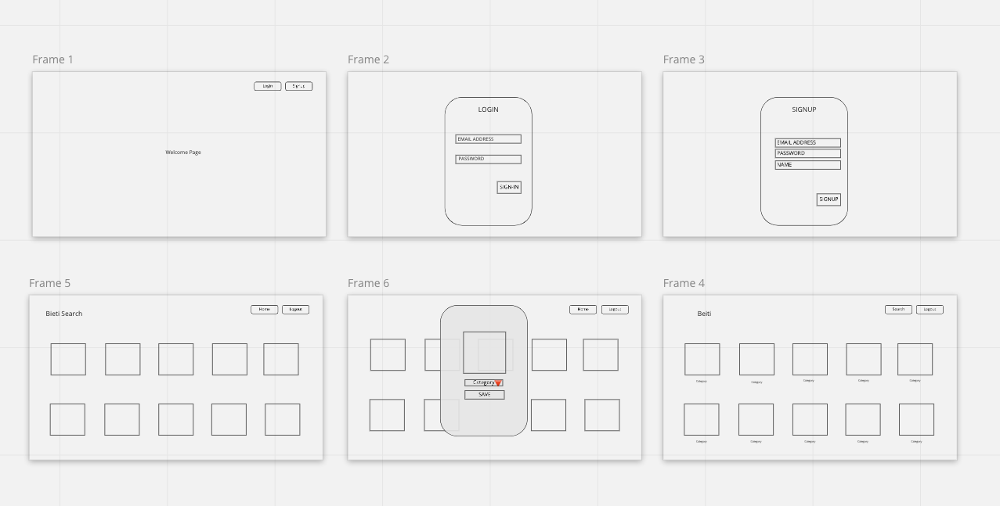
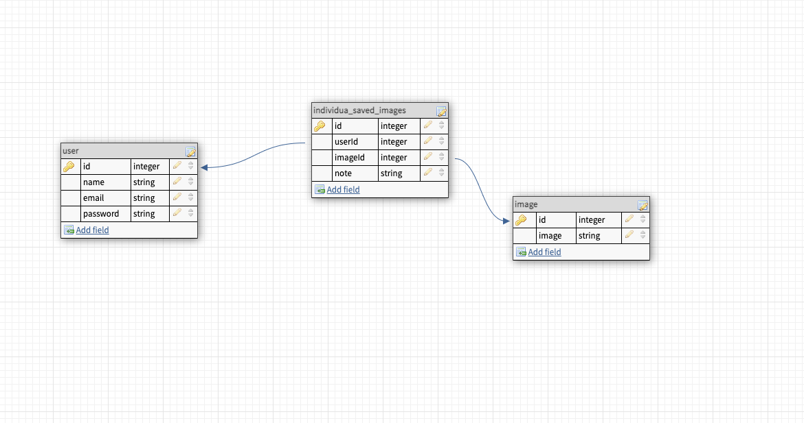

# Beiti

# Overview:

* Beiti is an app that allows users to create boards for idea they have for their home. They can save inspo picstures of room they would like to replicate, DIY projects they had do, etc. The user can come back to specific boards when they are ready to start re-doing their home!

# User Stories:
* When I go to the App, I see a login and signup button
* When I click on the login button, I can enter email and password to sign-in.
* When I click on the signup buttton, I am prompted to enter my name, email and password.
* When I am logged in, a page will appear with all boards a user has created
* There will be a search engine to search for images (a seed file)
* When a user clicks on a photo they can save an image with a category note
* When user saves images, they will be redirected to their page to see all saved images

# MVP:
* User can login, signup and logout
* User can search for photos
* User can add photo to their homepage
* User can delete photo if they no longer want it
* When user logs back in all photos saved previously are still there

# Routes:
### User
| Method | Path                   | Description                  |
|--------|------------------------|-----------------------------|
| GET    | /profile/       | Get user profile info       |
| POST   | /users/login          | Log-in page                      |
| POST   | /users                 | Sign-up page                 |
| DELETE    | /users/:id             |  Delete user       |
 

### Images
| Method | Path                   | Description                  |
|--------|------------------------|-----------------------------|
| GET    | /image/       | Get all images     |
| POST   | /users/:id          | add image to user profile    |
| DELETE | /board/:id     | User can delete image from profile    |

 

# Wireframes:

 

# Database Diagrams:

 

# Frontend Component Diagram:

# Technologies:
* Express
* React.js
* Sequelize

# Stretch Goals:
* Allowing users to save their own images to the account
* Creating boards for each category for the home

# Timeline:
### 5/21
* Complete both frontend and backend setup
* Finish the login, logout, signup and get navbars setup
* Create seed file

### 5/22 - 5/23
* Complete all routes

### 5/24
* Work on the switch between nav links
* Allow users to search for ideas

### 5/25
* Work on frontend
* Allow users to save images to  their page with a specific category

### 5/26
* Deployment jam
* Make sure everything is working

### 5/27
* Work on UI
* Fix any bugs

### 5/28
* Any last minute fixes or adds (possibly stretch goals)

# Repo Links
* https://github.com/sarahelbostany/beiti_frontend
* https://github.com/sarahelbostany/beiti_backend
